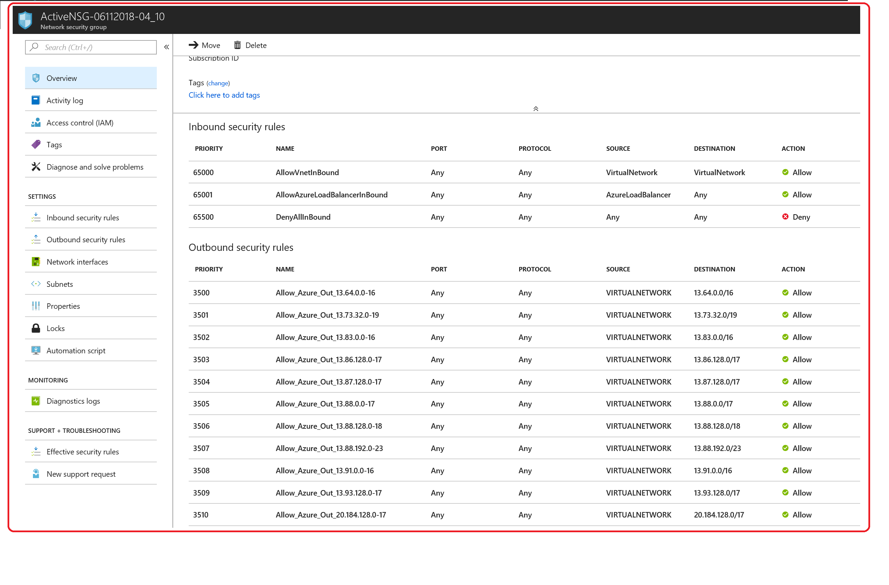

#Dynamic Update Azure Network Security Group Rules with Microsoft Public IP to restrict Azure VM Internet Traffic
Restrict Azure VM to only allow the traffic to Azure public IP addresses

Be very careful on “Deny All” outbound Internet traffic as you may prevent
Azure VM Agent and access to blobs and other functionalities not to work
properly. 
This script Imports an update set of Azure Public IP downloading and processing the "Microsoft Azure Datacenter IP Ranges" xml document.
It creates a new NSG with a new updated set of SecurityRule then, it associates this last with the Subnet and delete the previous Active NSG.

Example of Rules:

  "Name": "Allow_Azure_Out_191.238.70.0-23",
                           "Protocol": "*",
                           "SourcePortRange": "*",
                           "DestinationPortRange": "*",
                           "SourceAddressPrefix": "VIRTUALNETWORK",
                           "DestinationAddressPrefix": "191.238.70.0/23",
                           "Access": "Allow",
                           "Priority": 3588,
                           "Direction": "Outbound",
                           "ProvisioningState": "Succeeded"
                         } 

Usage
-----

Function: updateNSG
Parameters:
$regions = @("uswest")
$VnetName="Vnet"
$SubnetName = "Default"
$RSGName = "NSGPassiveActive-RSG" 

=> updateNSG $regions $VnetName $SubnetName $RSGName
 
 Special Thanks to Sérgio Velho

